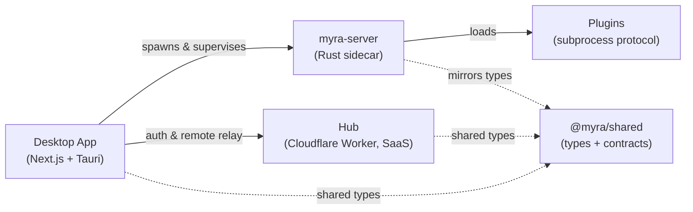

<div align="center">

# Myra Agents

**A desktop Kanban board that runs CLI coding agents.**

Drop a prompt on a card, launch it, and Myra spawns a configured coding-agent
binary (opencode · copilot · claude · custom) in headless mode and streams its
output back onto the board. Cards flow **Draft → Todo → In Progress → Waiting
Feedback → Awaiting Review → Done**. Schedules auto-materialize and launch cards
on a cron / daily / weekly / interval basis.

</div>

---

## The ecosystem

Myra is split into focused repos so the desktop app stays open-source while the
managed cloud layer stays private.

| Repo | What it is | |
|------|------------|---|
| **[Myra-Agents](https://github.com/Myra-Agents/Myra-Agents)** | The desktop app — a Kanban board that runs CLI agents. **Next.js 16 + Tauri v2 (Rust).** | 🌐 public |
| **[Myra-Agents-Shared](https://github.com/Myra-Agents/Myra-Agents-Shared)** | `@myra/shared` — TypeScript types, API contracts, pure domain helpers. | 🌐 public |
| **[Myra-Agents-Plugins](https://github.com/Myra-Agents/Myra-Agents-Plugins)** | Runtime plugins over a language-agnostic subprocess protocol — agent providers + event reactions. | 🌐 public |
| **[Myra-Agents-Dev](https://github.com/Myra-Agents/Myra-Agents-Dev)** | One-command multi-repo dev workspace bootstrap. | 🌐 public |
| **Myra-Agents-Server** | `myra-server` — the Rust agent runner + board store, shipped as a prebuilt sidecar binary the app supervises. | 🔒 private · binary published |
| **Myra-Agents-Hub** | The Cloudflare Worker SaaS relay (Clerk auth, remote instances). | 🔒 private |

## How it fits together



The app never contains the server/hub source — it talks to the **public prebuilt
server binary**. So you can build and run the whole desktop app without any
private access.

## Quick start

```bash
git clone https://github.com/Myra-Agents/Myra-Agents-Dev.git
cd Myra-Agents-Dev
./bootstrap.sh        # clones the repos, wires submodules, installs deps
./dev.sh sidecar      # fetches the prebuilt Rust server binary
./dev.sh app          # runs the desktop app
```

Outside contributors without access to the private repos still get a fully
working **app + shared + plugins** setup — `bootstrap.sh` skips what it can't
reach. See **[Myra-Agents-Dev](https://github.com/Myra-Agents/Myra-Agents-Dev)**.

## Extend it

Plugins extend the core without its source, over a small contract (a
`manifest.json` + stdin/stdout NDJSON):

- **Agent providers** — contribute agents to the card picker.
- **Event reactions** — react to bus events (Slack, webhooks, integrations…).

Start from **[Myra-Agents-Plugins](https://github.com/Myra-Agents/Myra-Agents-Plugins)**
(`PROTOCOL.md` + JSON schema + examples).

## Contributing

All repos follow **GitFlow-lite**: branch off `develop`, PR back into `develop`;
`main` is release-only. Conventional Commit subjects. Each repo carries a
`CLAUDE.md` with its build/run/convention notes.

---

<div align="center">
<sub>Made with Kanban, coding agents, and a lot of streamed stdout.</sub>
</div>
