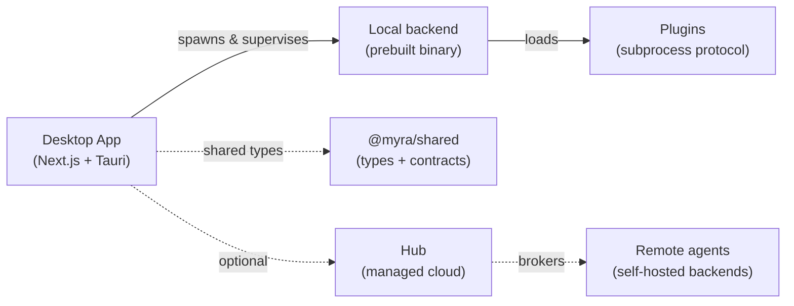

<div align="center">

# Myra Agents

**A desktop Kanban board that runs CLI coding agents.**

🌐 **[myra-agents.github.io](https://myra-agents.github.io)**

Drop a prompt on a card, launch it, and Myra spawns a configured coding-agent
binary (opencode · copilot · claude · custom) in headless mode and streams its
output back onto the board. Cards flow **Draft → Todo → In Progress → Waiting
Feedback → Awaiting Review → Done**. Schedules auto-materialize and launch cards
on a cron / daily / weekly / interval basis.

*Myra* is Swedish for **ant** — build your colony of Agents to achieve your goals.

</div>

---

## Repos

| Repo | What it is | |
|------|------------|---|
| **[Myra-Agents](https://github.com/Myra-Agents/Myra-Agents)** | The desktop app — a Kanban board that runs CLI agents. **Next.js 16 + Tauri v2 (Rust).** | 🌐 |
| **[Myra-Agents-Shared](https://github.com/Myra-Agents/Myra-Agents-Shared)** | `@myra/shared` — TypeScript types, API contracts, pure domain helpers. | 🌐 |
| **[Myra-Agents-Plugins](https://github.com/Myra-Agents/Myra-Agents-Plugins)** | Runtime plugins over a language-agnostic subprocess protocol — agent providers + event reactions. | 🌐 |
| **[Myra-Agents-Dev](https://github.com/Myra-Agents/Myra-Agents-Dev)** | One-command multi-repo dev workspace bootstrap. | 🌐 |
| **Myra-Agents-Server** | The app's prebuilt backend binary. | 🔒 |
| **Myra-Agents-Hub** | Managed cloud service. | 🔒 |

<sub>🌐 public · 🔒 private</sub>

## How it fits together



The desktop app ships with a **prebuilt local backend binary** — so you can build
and run the whole app from open source, no extra access needed.

## Quick start

One command — clones every repo, wires it up, installs deps:

```bash
curl -fsSL https://raw.githubusercontent.com/Myra-Agents/Myra-Agents-Dev/develop/install.sh | bash
```

Then run the app:

```bash
cd ~/Myra-Agents-Dev
./dev.sh sidecar      # fetch the prebuilt backend binary
./dev.sh app          # run the desktop app
```

See **[Myra-Agents-Dev](https://github.com/Myra-Agents/Myra-Agents-Dev)** for the
full workspace setup.

## Extend it

Plugins extend the app without touching its core, over a small contract (a
`manifest.json` + stdin/stdout NDJSON):

- **Agent providers** — contribute agents to the card picker.
- **Event reactions** — react to board events (Slack, webhooks, integrations…).

Start from **[Myra-Agents-Plugins](https://github.com/Myra-Agents/Myra-Agents-Plugins)**
(`PROTOCOL.md` + JSON schema + examples).

## Contributing

All repos follow **GitFlow-lite**: branch off `develop`, PR back into `develop`;
`main` is release-only. Conventional Commit subjects. Each repo carries a
`CLAUDE.md` with its build/run/convention notes.

---

<div align="center">
<sub>Made with Kanban, coding agents, and a lot of streamed stdout.</sub>
</div>
